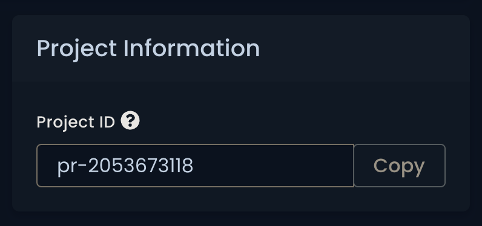
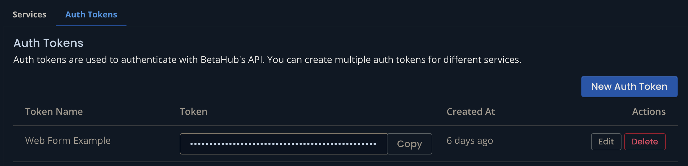

# FAQ

# How to find the Project ID and API Key?

1. Got to the [app.betahub.io](https://app.betahub.io/) and log in
2. Open your project
3. Go to Settings > General - **here is your Project ID**

4. Go to Settings > Integrations and reveal the Auth Tokens tab - **here is your API Key**

5. If your list is empty, you need to create a new Token, clicking on the `New Auth Token` button. Remeber to allow for creating bug reports clicking on the corresponding checkbox.