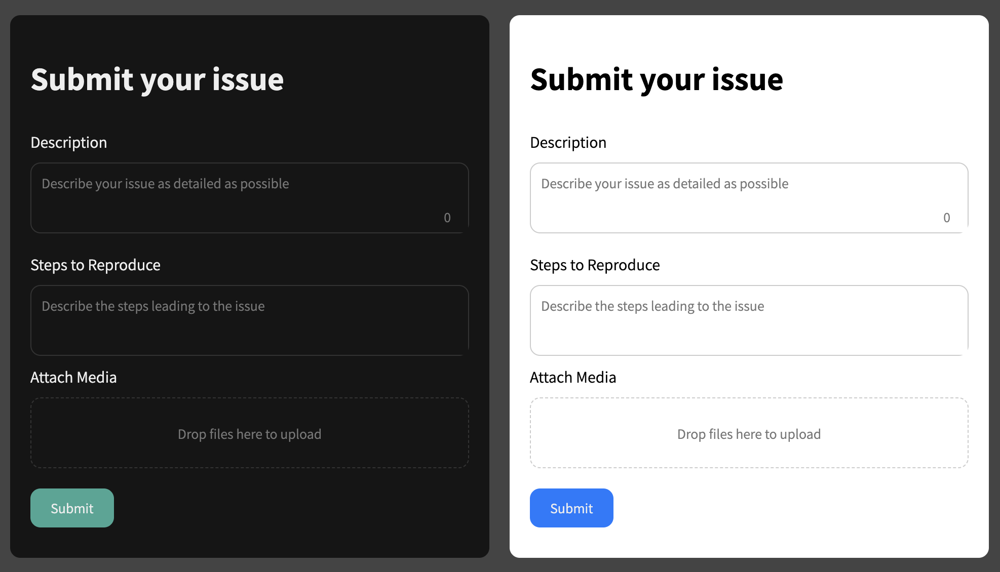

# Theming

## Dark/Light theme

The dark theme is the default, but you can easily switch to a light theme by setting the `light` class.

```html
<form
  data-bhwf-form
  data-bhwf-project-id="example-project-id"
  data-bhwf-api-key="example-api-key"
  class="light"
>
  <!-- Form content -->
</form>
```



## CSS variables

You can set the css variables to change the general style and colors. Just overwrite them using a css file or script tag under the imported `bhwf.min.css` in the HTML head.

```css
[data-bhwf-form] {
  --bhwf-radius: 10px;
  --bhwf-transition: 0.3s ease;

  --bhwf-form-bg-color: #151515;
  --bhwf-text-color: #eee;
  --bhwf-text-color-secondary: #777;

  --bhwf-input-bg-color: #151515;
  --bhwf-input-border-color: #333;
  --bhwf-input-border-color-focus: #444;

  --bhwf-button-bg-color: #007bff;
  --bhwf-button-bg-color-hover: #0056b3;
  --bhwf-button-text-color: #eee;

  --bhfw-modal-bg-color: #151515dd;

  --bhwf-error-color: #cb1d1d;
  --bhwf-error-color-subtle: #97181887;

  --bhwf-file-preview-bg-color: #1a1a1a;
}
```

Example - change the buttons color from blue to green:

```html
<head>
  <link
    rel="stylesheet"
    type="text/css"
    href="https://unpkg.com/betahub-web-form@1.*.*/dist/bhwf.min.css"
  />

  <style>
    [data-bhwf-form] {
      --bhwf-button-bg-color: #40a695;
      --bhwf-button-bg-color-hover: #307e79;
    }
  </style>
</head>
```

## More advanced changes

You can [download](https://github.com/patchkit-net/betahub-web-form/blob/main/src/bhwf.css) and modify the css file or style elements completely from scratch.